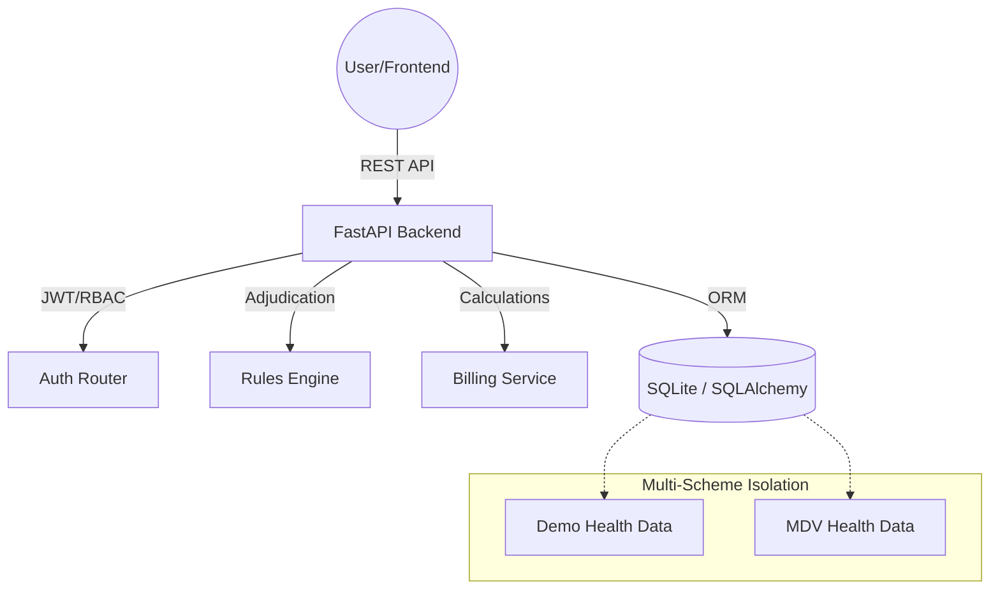

# SA Healthcare Administration Platform - Backend

A comprehensive, multi-scheme healthcare administration backend built with FastAPI. This platform supports multiple medical schemes with full data isolation, role-based access control, and plans for claims processing engines, contribution automation and whatever follows.

## 🏗️ System Architecture



## 🚀 Key Features

### 🏢 Multi-Scheme Foundation
- **Data Isolation**: Complete logical separation between different medical schemes at the database level.
- **Dynamic Branding Support**: Per-scheme UI theming (colors, logos) stored in the database for frontend consumption.
- **Role-Based Access Control (RBAC)**: 6 functional roles per scheme (Super Admin, Scheme Admin, Claims Processor, Auth Officer, Finance Officer, Call Centre).

### ⚖️ Claims & Adjudication Engine
- **7-Stage Pipeline**: Automated validation across Administrative, Industry, Clinical, and Scheme rules.
- **PMB Override**: Automated detection and mandatory funding of Prescribed Minimum Benefits (PMB).
- **Network Routing**: Intelligent routing to Designated Service Providers (DSP) with automated co-payment triggers for out-of-network usage.
- **Tariff Support**: Full support for ICD-10, NHRPL, and NAPPI coding standards.

### 👥 Member & Chronic Care
- **Lifecycle Management**: Dependant tracking with automated child-to-adult rate transitions.
- **SA ID Validation**: Built-in Luhn validation for South African ID numbers.
- **Benefit Tracking**: Real-time benefit balance management with annual initialisation logic.
- **Chronic Registration**: CDL (Chronic Disease List) registration workflow and medicine formulary compliance.

### 💰 Financial & Billing
- **Contribution Calculator**: Dynamic premium calculation based on plan option, family size, and member age.
- **Savings Management**: Personal Savings Account (PSA) allocation and monthly crediting for savings-based plans.
- **Solvency Tracking**: Financial reporting on scheme liabilities and assets.

### 📜 Compliance & Audit
- **Immutable Audit Logs**: Comprehensive event trail of all state-changing operations for regulatory compliance.
- **Dispute Management**: Workflow for handling claim rejections and member disputes within statutory timelines.
- **CMS Reporting**: Exportable reports for PMB coverage, rejection rates, and benefit exhaustion.

## 🗄️ Data Model

The platform uses a relational data model designed for CMS (Council for Medical Schemes) compliance:

- **Core**: `Scheme`, `PlanOption`, `User`.
- **Members**: `Member`, `Dependant`, `BenefitBalance`, `SavingsAccount`.
- **Clinical**: `ICD10Code`, `TariffCode`, `NappiCode`, `Formulary`.
- **Operations**: `Claim`, `ClaimLine`, `Authorisation`, `AuthorisationLine`.
- **Provider**: `Provider`, `ProviderNetwork`.
- **Governance**: `AuditLog`, `Dispute`.

## 🛠️ Technical Stack

- **Framework**: FastAPI (Python 3.10+)
- **ORM**: SQLAlchemy 2.0
- **Database Migrations**: Alembic
- **Validation**: Pydantic v2
- **Testing**: Pytest
- **Database**: SQLite (Local development/demo), extensible to PostgreSQL

## 💻 Local Development

### Prerequisites
- Python 3.10+
- Virtual environment (recommended)

### Setup

1. **Install dependencies**:
   ```bash
   pip install -r requirements.txt
   ```

2. **Database Initialization**:
   Create tables and seed schemes (**Only required once** after cloning):
   ```bash
   alembic upgrade head
   python scripts/seed.py
   python scripts/seed_mdv.py
   python scripts/seed_tpa.py
   ```

3. **Start the API server**:
   After initialization, you can simply start the server for subsequent runs:
   ```bash
   uvicorn app.main:app --reload
   ```

- **API Base URL**: `http://localhost:8000`
- **Interactive Documentation**:
  - Swagger UI: `http://localhost:8000/docs`
  - ReDoc: `http://localhost:8000/redoc`

## 🧪 Testing

The platform includes a robust testing suite for the backend services and adjudication logic.

### Frameworks
- **Backend**: `pytest` with `pytest-asyncio` for asynchronous testing.
- **Database**: Uses a dedicated SQLite in-memory/file-based session for integration tests via `tests/conftest.py`.

### Test Categories
- **Adjudication Pipeline**: Integration tests for the 7-stage rules engine.
- **Member Management**: Validation of SA ID Luhn algorithm and member status transitions.
- **Benefit Routing**: Verification of benefit bucket logic (Hospital, Day-to-Day, Chronic).
- **Authorisations**: Workflow tests for pre-auth requests and status updates.

### Running Tests
```bash
pytest
```

## 🤝 Contributing

We enforce a strict branching and merge policy to maintain code quality. Direct pushes to `main` are blocked.

### Workflow
1. **Branching**: Always create a new branch for your work.
   - **Naming Convention**: Use category prefixes followed by a forward slash and a short, descriptive name in kebab-case.
   - **Examples**: `feature/add-auth-logs`, `bugfix/fix-claim-validation`, `chore/update-dependencies`.
2. **Pushing**: You can only push to your own feature branch.
3. **Merging**: Submit a Pull Request (PR) for review to merge into `main`. ONLY do this when you have a feature complete and have tested locally and it is ready to go to production. 

### Example Git Commands
```bash
# 1. Create and switch to a new feature branch
# Use category/kebab-case-description
git checkout -b feature/your-feature-name

# 2. Make your changes and commit them
git add .
git commit -m "Brief description of changes"

# 3. Push your branch to the repository
git push origin feature/your-feature-name

# 4. Create a Pull Request (PR)

#### Option A: Via GitHub Web UI (Recommended)
1. Push your branch (Step 3 above).
2. Open the repository on GitHub in your browser.
3. Switch to your branch in the branches dropdown
4. You should see a yellow highlight banner: **"feature/your-feature-name had recent pushes x minutes ago"**.
5. Click the **[Compare & pull request]** button.
6. Provide a clear title and description for your changes.
7. Click **[Create pull request]**.

#### Option B: Using the GitHub CLI
```bash
gh pr create --title "Brief description of changes" --body "Details about implementation"
```
```

## 🔐 Demo Credentials

### Demo Health Medical Scheme (DHMS)

| Role | Email | Password |
|------|-------|----------|
| Super Admin | admin@demohealth.co.za | Demo@1234 |
| Scheme Admin | schemeadmin@demohealth.co.za | Demo@1234 |
| Claims Processor | claims@demohealth.co.za | Demo@1234 |
| Auth Officer | auth@demohealth.co.za | Demo@1234 |
| Finance Officer | finance@demohealth.co.za | Demo@1234 |
| Call Centre | callcentre@demohealth.co.za | Demo@1234 |

### MDV Health Medical Scheme (MDVH)

| Role | Email | Password |
|------|-------|----------|
| Super Admin | admin@mdvhealth.co.za | MDV@1234 |
| Scheme Admin | schemeadmin@mdvhealth.co.za | MDV@1234 |
| Claims Processor | claims@mdvhealth.co.za | MDV@1234 |
| Auth Officer | auth@mdvhealth.co.za | MDV@1234 |
| Finance Officer | finance@mdvhealth.co.za | MDV@1234 |
| Call Centre | callcentre@mdvhealth.co.za | MDV@1234 |

### TPA Multi-Scheme Admin

| Role | Email | Password |
|------|-------|----------|
| Super Admin | tpa@tpaadmin.co.za | TPA@1234 |

## 📊 Seed Data Overview

### Demo Health (DHMS)
- **Plans**: 3 options (Hospital R1,850 / Comprehensive R3,200 / Executive R5,500)
- **Members**: 50 members with valid SA ID numbers and dependants.
- **Providers**: 5 healthcare providers.
- **Activity**: 20 claims, 10 authorisations.

### MDV Health (MDVH)
- **Plans**: 3 options (Core R1,420 / Plus R2,780 / Premier R4,800)
- **Members**: 30 members (Rustenburg/mining demographic).
- **Providers**: 6 healthcare providers.
- **Activity**: 15 claims, 9 authorisations.

> **Note**: Data isolation is strictly enforced. Logging in as one scheme prevents access to any other scheme's members, claims, or financial data.


v0.0.5